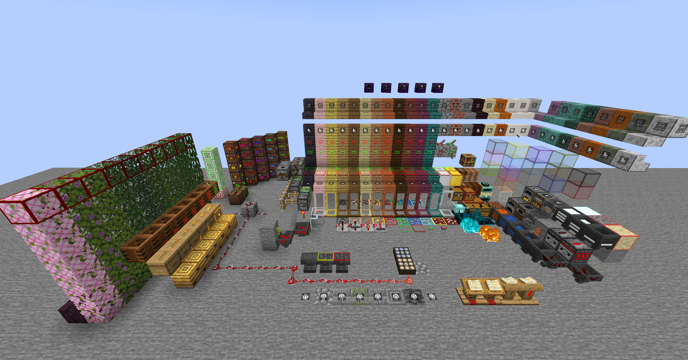
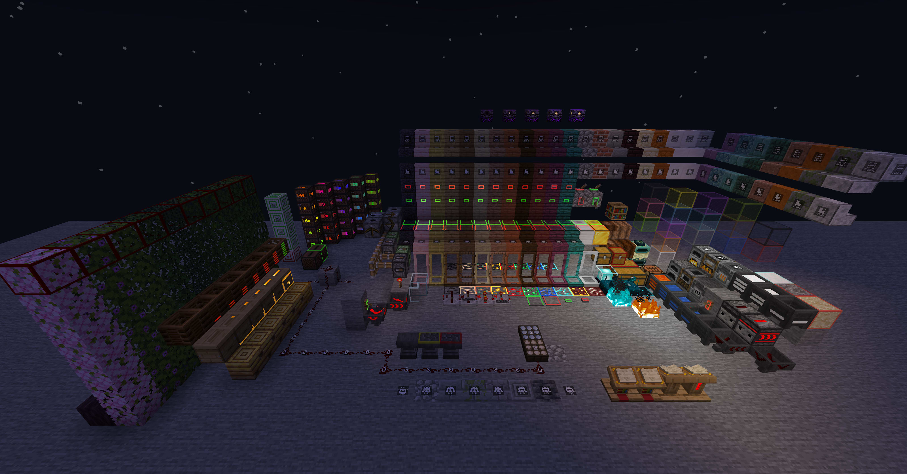

# 欢迎使用

透视与高亮资源包是一款专治各种眼瞎的功能性资源包，通过易混淆纹理差异化、削减遮挡视野的纹理、提供更多信息、扁平化 UI 设计等方式优化玩家的游戏体验。

## :material-sign-direction: 导航
- [MCBBS](https://www.mcbbs.net/thread-867407-1-1.html){ targer="_blank" }
- [GitHub 反馈](https://github.com/sheep-realms/Perspective-highlight/issues){ targer="_blank" }

## :material-license: 授权协议
- :fontawesome-regular-copyright: Copyright - 作者保留所有权利
- :fontawesome-brands-creative-commons-by: Attribution - 署名（作者 / Author : Sheep-realms）
- :fontawesome-brands-creative-commons-nc: Non Commercial - 非商业
- :material-dots-horizontal: Additional Restrictions - 附加限制

关于这个资源包的使用，您可以：

- 下载并使用资源包。
- 对资源包做一些个性化修改以方便自己使用。
- 在非公开场合分享资源包文件。
- 制作依赖于该资源包的补充内容并发布。

您不可以：

- 稍作修改甚至不修改就二次发布，甚至不注明原作者。
- 将资源包用作商业用途。
- 将资源包搬运到国内其他网站，甚至不使用原下载地址。
- 将资源包放入整合包中并发布。
- 利用此资源包进行任何违反 Minecraft EULA 的行为。